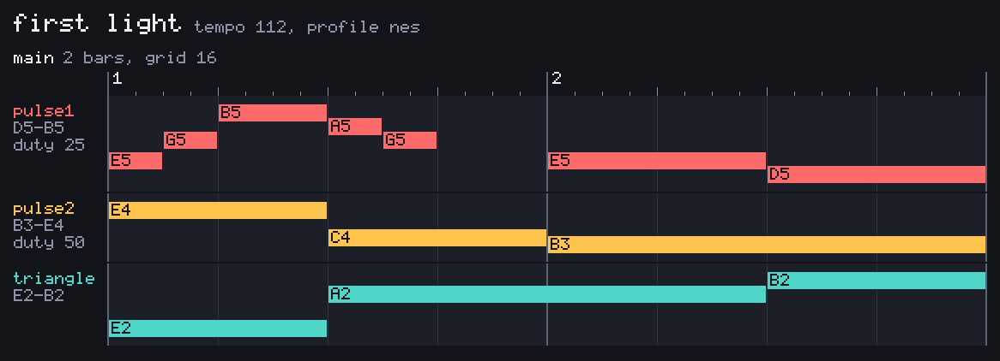

# piropipo



a chiptune instrument for AI agents. `piro` takes a small grid notation in and gives you 8-bit wav files out, plus enough verification that an agent can trust a sound it will never hear.

## why this exists

agents turn out to be decent little composers and terrible at classic music macro languages. in MML, a note's position is the sum of every duration before it - one wrong length early in the bar and everything after it shifts, with nothing on the page looking wrong. an agent will make exactly that mistake, confidently, every time.

so the grid has one hard rule: a note's position is always written down, never derived. `2.9: A2 x16` means bar 2, slot 9, rings 16 slots. a wrong length stays a local mistake, and the checker can verify every line on its own. the full notation fits in [docs/format.md](docs/format.md), and honestly the example above is most of it.

the other half of the trick is constraint profiles. the default `nes` card only lets through what the actual chip could play (two pulses, a triangle with no volume knob, a noise lane), which is the difference between sounding like an NES and sounding like a synth with a costume on.

## the verbs

```
piro track song.piro     # grid in, wav out, beside the input
piro sfx coin            # a game sound from a preset; real units to tweak it
piro check song.piro     # lint + render stats, writes nothing
piro roll song.piro      # the piano-roll png up top
```

everything answers in json on stdout, because the main user is a program. `--human` gets you sentences instead.

the deaf-composer problem is handled in layers: `check` lints positions and chip ranges before anything renders, the stats report duration, peak and whether a lane came out silent, and `roll` draws the grid so eyes (yours, or a vision model's) can catch what numbers miss.

`piro sfx` deserves its own sentence: presets like `coin`, `jump` and `explosion` work with zero knobs, the dials are real units (Hz, ms, semitones) instead of sfxr's 0-to-1 mystery floats, and the same command gives you the same bytes every run. the conversion table lives in [docs/sfx-mapping.md](docs/sfx-mapping.md).

## building

```
cargo build --release
```

one binary, `piro`. rust because the alternative was python and i'd rather not.

## status

young. the grid, the four verbs and the nes profile work and are tested; song structure (pattern order, repeats) and effects (vibrato, arpeggio, slides) are designed but not in yet. the format may still shift under you until those land.
